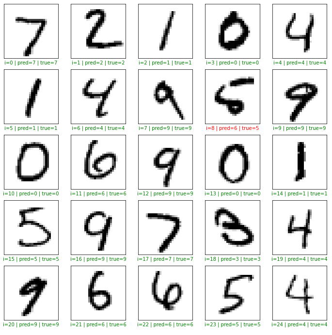

# DigitRecognition
Basic image classification (digit recognition) using the Keras API and TensorFlow backend. This project used the MNIST database as its source for both its training and test data.

The utilized Sequential model is comprised of 784 inputs, two hidden layers composed of 128 neurons each, and an output layer of 10 neurons using softmax activation. The model was then trained for 5 epochs and performed with 97% accuracy against the test data.

